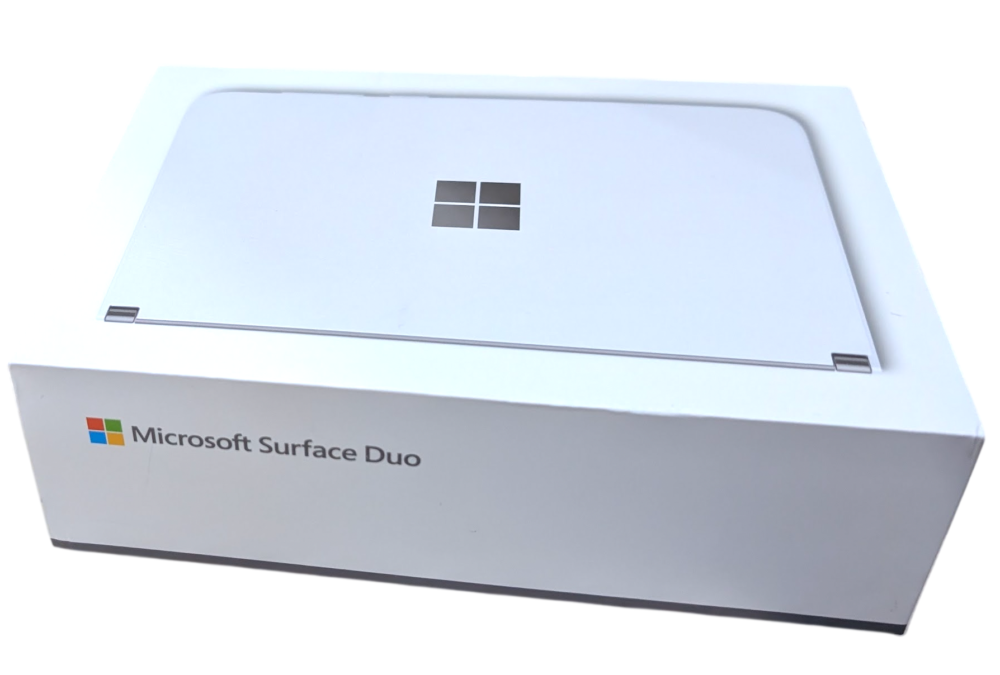

# 서피스듀오 리뷰
어느 날 폴더블폰 아이쇼핑을 하다가 서피스 듀오라는, 듀얼 스크린 폰의 존재를 발견했다.

[서피스 듀오1 (OG)](https://support.microsoft.com/ko-kr/surface/models/surface-duo-1st-gen-features-and-specs)는 2019년 10월에 마이크로소프트에서 출시한 제품인데, 이제는 연식이 꽤 지난 제품이다.

원래는 픽셀 폴드를 구하려고 했었다. 하지만 폴더폰 액정이 고장나는 사례들을 보고 나니까, 선뜻 사고 싶지 않아졌다. 그리고 언젠가는 접고 펼치다가 액정이 고장날 것이라는 의견이 다분했다.

그래서 애초에 물리적으로 두 액정으로 분리된 서피스 듀오를 선택했다. 현재 국내에서는 서피스듀오를 중고로 구하기 어려워 나름 희소성이 있는 듯 하다.

## 범퍼케이스
중고거래 했을 때 모서리에 붙이는 범퍼케이스가 일부 부러진 상태여서, 본드로 이어 붙여도 소용이 없었다. 계속 부러진다. 그래서 케이스 없이 사용하고 있다. 제일 큰 문제는, 케이스를 끼운 채 기기을 접으면 화면이 꺼지지 않는다는 단점이 있다.

## duo-de 프로젝트
서피스 듀오를 중고로 구한 후 가장 먼저 했던 일은, [duo-de](https://github.com/Archfx/duo-de)라는 커스텀 롬을 올리는 것이었다.

순정 롬의 최신 버전이 Android 12L이며, 2023년 9월 10일 마지막 업데이트였다.

그래서 커스텀 롬으로 AOS 16 버전으로 올리면 조금 더 쾌적한 환경에서 사용할 수 있지 않을까 하는 기대가 있었다.

그리고 실제 경험했을 때 그 기대는 산산조각이 났다.
https://github.com/Archfx/duo-de/releases/tag/v2025.06.26 를 사용했다.

다음은 장단점을 설명할 것인데, 단점이 너무 많아 이것부터 설명한다.
### 단점
1. **앱을 업데이트 할 때마다 강제 재부팅됨**
2. **앱을 삭제할 때마다 강제 재부팅됨**
3. 픽셀 폴드의 UI/UX를 체험 가능. 하지만 서피스 듀오와는 UX가 부적합하다고 느낌
	- 아래는 단점
	- 애초에 듀오의 역할은 멀티태스킹 용도이다. 2개의 앱을 동시에 실행하고, 실행할 앱을 다른 것으로 전환하기 용이해야 한다.
	- 그러나 안드로이드 폴드폰 화면 분할 방식은 조금 사용하기 불편하다.
	- Android 순정 런쳐는 런쳐 독이 Microsoft Launcher 처럼 항상 표시되는 게 아니라, 아래에서 위로 스와이프 해야 독이 표시된다. 그 다음 독의 앱 아이콘을 드래그해야 하는 과정이 필요하다.
	- 이 방식은 기존 서피스 듀오의 경험을 훼손시키며 복잡하게 만든다.
4. 지문인식 지원 불가 (핀, 비밀번호, 페이스 인식만 지원)
    - 페이스 인식은 커스텀 롬에서만 지원하는 기능 
	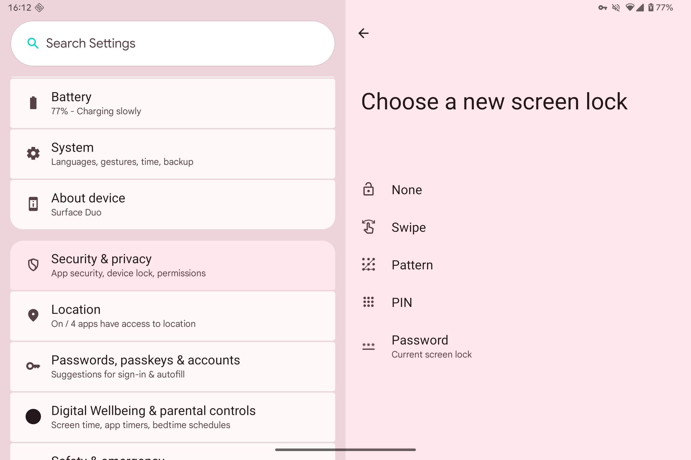
5. Play Integrity 문제 발생(왓츠앱, ChatGPT, 당근 등 사용 불가)
	- ChatGPT 
	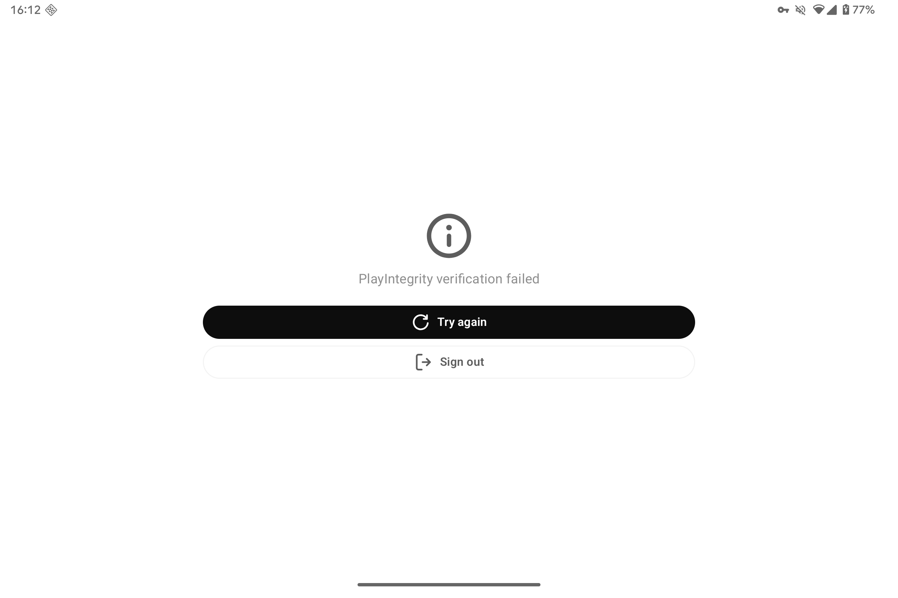
	- WhatsApp
	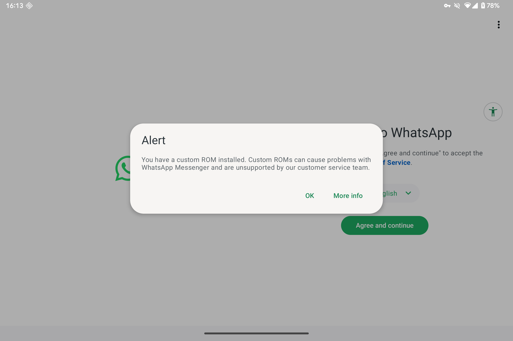
	- 당근
	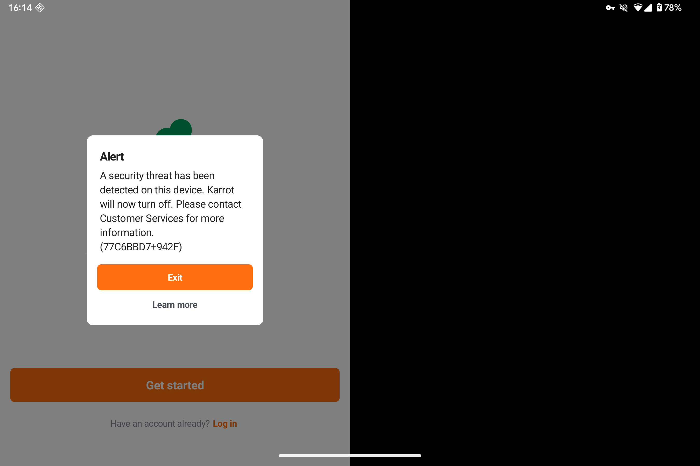
6. USIM 인식 불가
7. 런쳐 하단 독 버그(펼침모드에서 런쳐 앱을 6개, 폰모드에서는 5개밖에 사용 못 함, 가끔 독이 안 보이기도 함)
	a. 펼침모드에서 독 앱 6개 표시 (정상)
	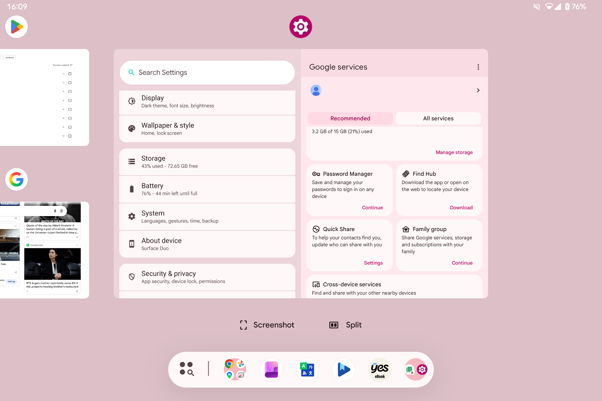
	
	b. 싱글모드에서 독 앱 6개 표시 (정상)
	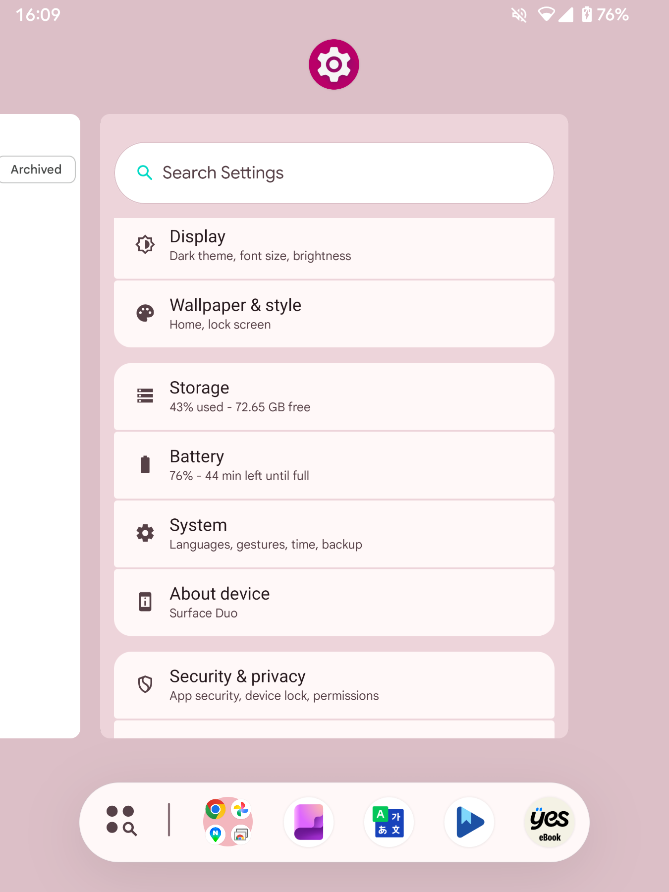
	
	c. 펼침모드에서 독이 보이지 않는 버그
	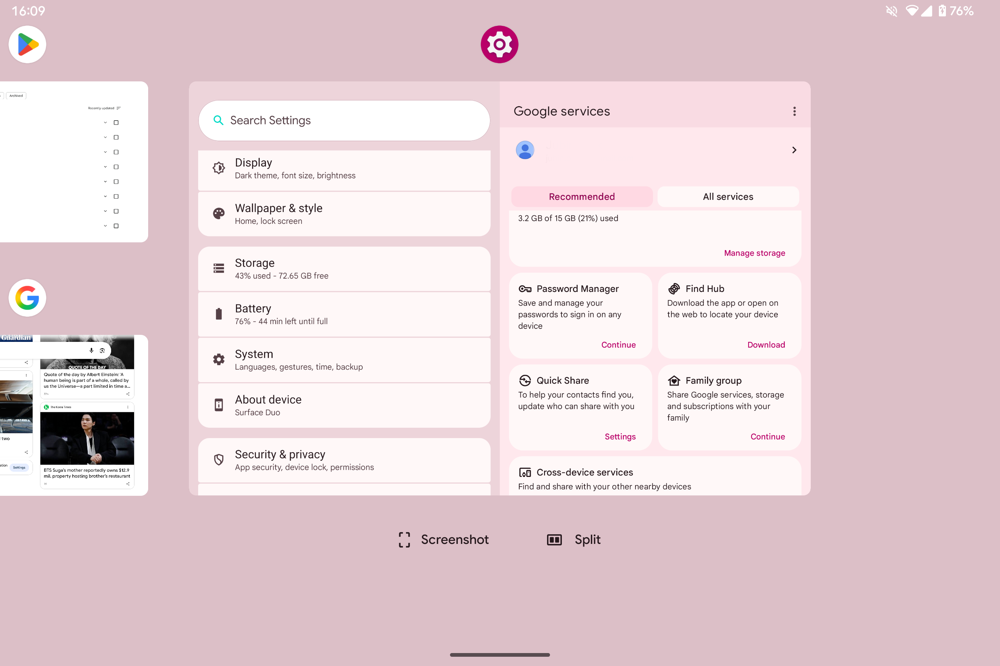

8. 홈에서 App Info를 누르면 팅기는 현상
	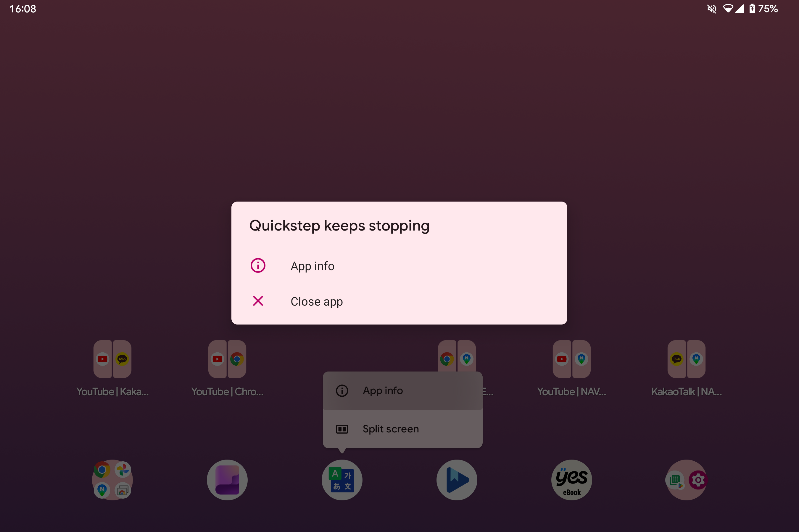
### 장점
1. 체감상 아주 약간 빠릿하게 도는 느낌이 있다. 그저 기분탓일수도 있다.
2. Disable Hinge Gap 기능 지원 (힌지 부분 가려짐 방지 기능)
	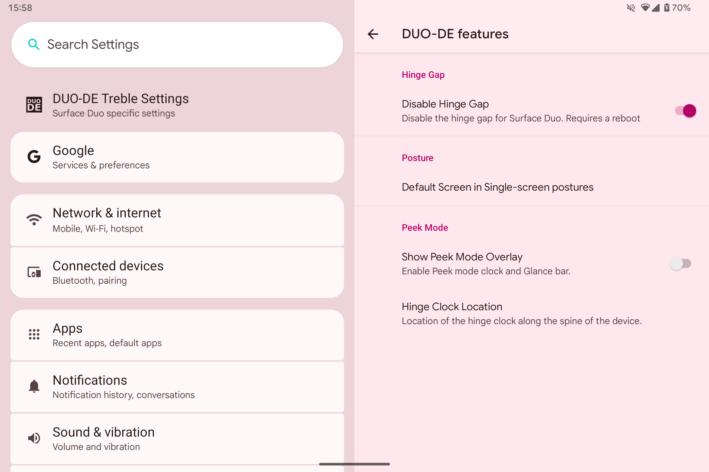
3. Gboard 키보드가 화면 상태에 따라 변함
	- 듀얼모드에서의 Gboard 상태
	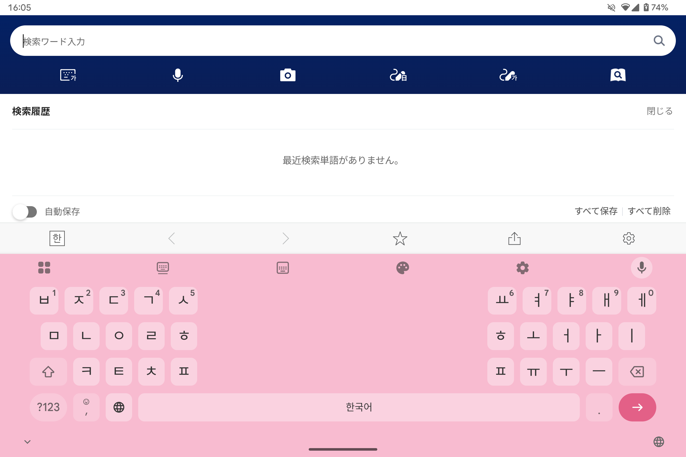
	- 싱글모드에서의 Gboard 상태
	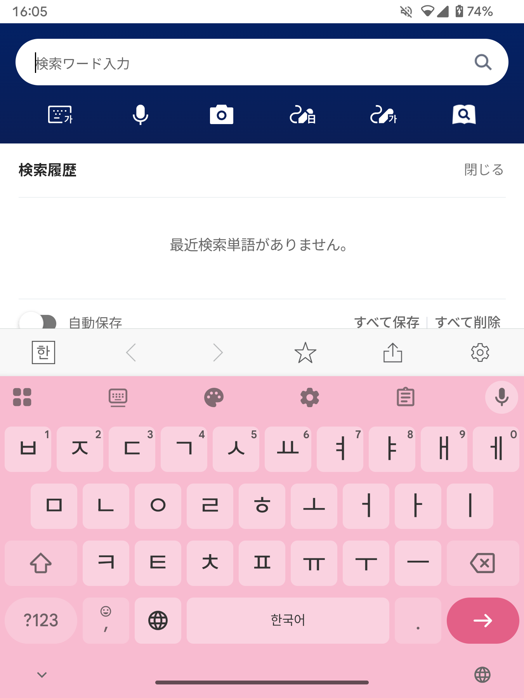

다른 건 몰라도 단점 1, 2번이 너무 사람을 힘들게 했기에, 2~3주 정도 사용하다가 다시 순정 롬으로 돌아왔다.
## Windows on Surface Duo
https://github.com/woa-project/surfaceduo-guides

Surface Duo 기기에서 윈도우11 (ARM)을 올릴 수 있게 해주는 비공식 프로젝트이다. 다시 말해 이 기기를 미니 PC로 변신시킬 수 있다.

이걸로 어떤 작업을 해본 적은 없다. Visual Studio 2026 설치해서 Hello World 프로그램 만든 것 뿐, 하드웨어 사양이 좋지 않아서 사실 뭘 하기에는 애매하다. 호기심을 충족하기 위한 용도라고 보면 된다.

특히 듀얼 부팅이 가능하다. 기기를 펼친 상태로 전원을 키면 안드로이드로 부팅하고, 접은 상태로 전원을 키면 윈도우로 부팅한다.

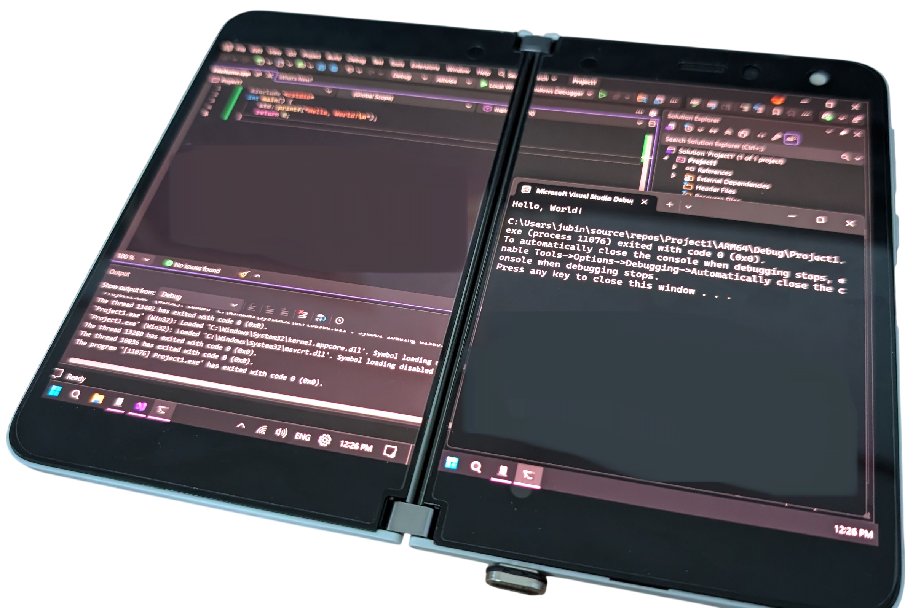
### 단점
1. 스피커, 이어폰 모두 사운드가 들리지 않음
2. 블루투스 연결이 실패됨
3. 배터리 잔량을 확인할 수 없음
4. 오른쪽 패널의 발열이 뜨거울 정도임
5. 최초로 설정창 한번 여는데 체감상 1분 소요됨

## Surface Slim Pen 2
호기심에 서피스 슬림펜2도 구매했다. 가격은 정품 박스포장기준 19~20만원 정도로 체감상 꽤 나가는 편이다. 물론 나는 벌크제품으로 14만원 정도에 구매했다. 용도는 draft 필기용 및 직접 필기하여 타이핑 하는 용도이다. 원래는 Uogic 사의 저렴한 펜을 사서 썼다가 실망하고 서피스펜으로 갈아탔다. 저가형 펜은 듀오에서 펜을 접촉하지 않아도 펜이 작동하는 치명적인 단점이 있었기 때문이다. 서피스 펜은 상대적으로 세밀한 펜 필기가 되어 상황이 많이 개선됐다.

## 마치며: 앞으로 내 서피스 듀오의 용도는?
나는 책을 거의 읽지 않는다. 얼마전 집에 있는 책들을 비파괴스캔 후 지인들에게 기부하거나 처분했다. 미니멀리즘을 실천하기 위해서였다. 읽지도 않을 전공책들이 대다수였다. 과거의 내가 비싸게 산 책들을 읽지도 않고 버리니까 과거의 충동구매를 후회했다. 전자책보다 종이책을 더 선호하긴 하지만, 이제는 공간 차지의 부담을 느끼기 싫어졌다. 가능하면 책은 전자책으로 구매하려고 한다. 그리고 서피스 듀오로 구매한 책들을 읽을 것이다.

또 하나는, 외국어 필기공부이다. 한자나 일본어 등 단어 획 하나하나 쓰기를 연습하기 위함이다. 게을러서 잘 안 하는 게 문제지만 말이다.. 아무튼 앞으로 독서나 언어공부를 통해 인문학적 소양들을 길러보려 한다.